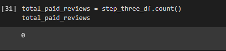
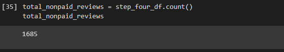
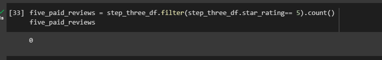
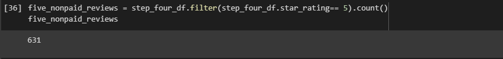
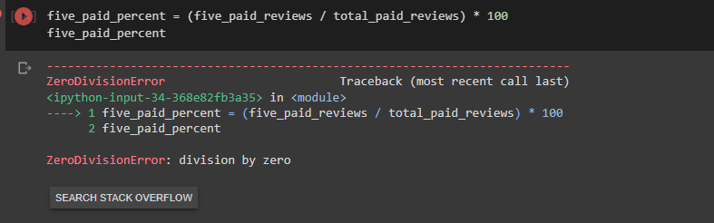
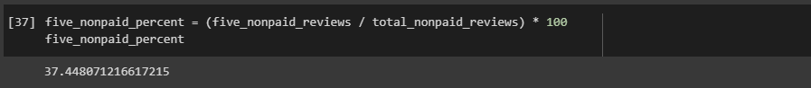

# Amazon_Vine_Analysis

## Overview of analysis
The purpose of this analysis was to first create your RDS, then get that database you created into PostgreSQL. The next thing we did was create tables using the given schema. We then sorted the data into 4 dataframes and wrote them to our tables in SQL. The 2nd deliverable was to take the vine dataframe we created in deliverable 1 and run an analysis on that dataframe. 

## Results
* How many Vine reviews and non-Vine reviews were there?

* How many Vine reviews were 5 stars? How many non-Vine reviews were 5 stars?

* What percentage of Vine reviews were 5 stars? What percentage of non-Vine reviews were 5 stars?

## Summary
Off the bat I would say there is not any positivity bias for reviews in the vine program because accorrding to my data there were no reviews for paid vine reviews. I think another analysis that we could do is to run an analysis for verified purchase. See if there is a relationship between verified purchase reviewers and non verified purchase reviewers. 
